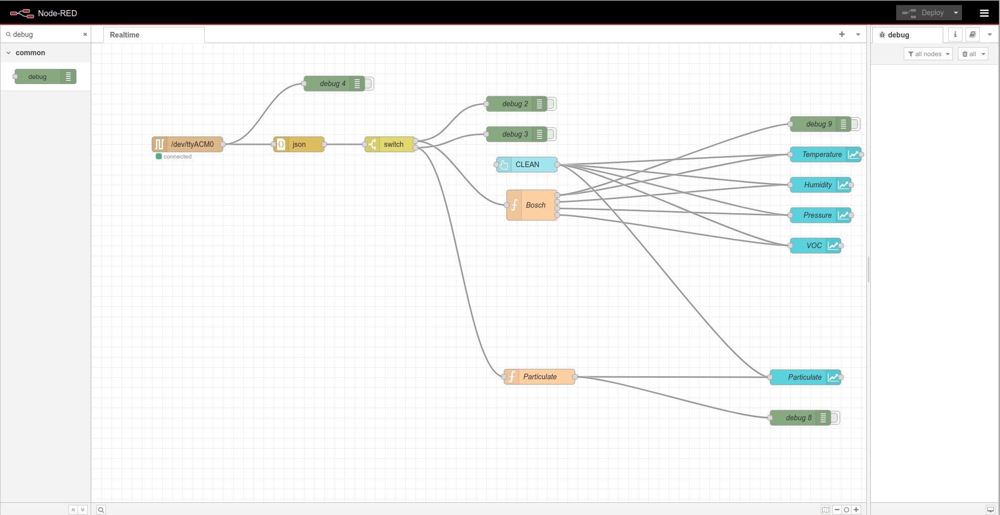
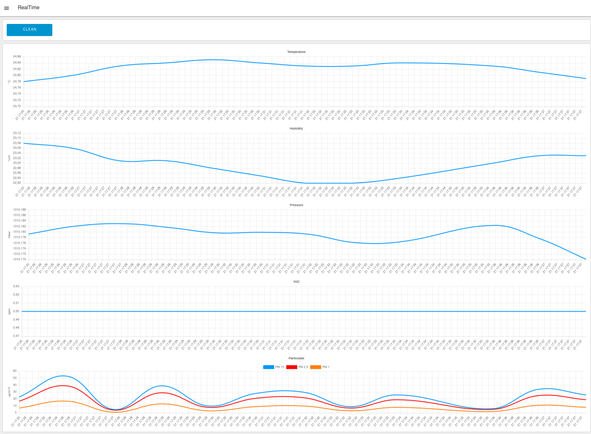

## POLVERINE_DEMO: Stream sensor data over USB

### A Complete yet Simple Demo

This firmware collects sensor measurements and transmits them using the ESP32-S3 module's native USB connection. 

The system also benefits from the latest SDK for the BMV080 sensor, which is now publicly available. This SDK enables the reading of particulate matter (PM) values for PM10, PM2.5, and PM1. The full range of sensed quantities includes:

- Temperature
- Relative Humidity
- Barometric Pressure
- Volatile Organic Compounds (V.O.C.)
- Particulate Matter 10 (PM10)
- Particulate Matter 2.5 (PM2.5)
- Particulate Matter 1 (PM1)

### Data Visualization Made Easy

To facilitate data analysis and visualization, a separate NodeRed ["RealTime Flows"]((../nodered/client_rt_flows.json)) interface has been developed. This interface collects data from USB connection and plots data in real time. 




### Adding Bosch SDKs to Polverine source code

The POLVERINE_DEMO communicates with the Bosch BME690 & BMV080 sensors and need to use the SDKs published by Bosch Sensortec.

The SDKs source code and compiled libraries cannot be stored in this repository, but must be downloaded by the user from the Bosch website by accepting the licence agreement.

- [BMV080 SDK r.11.0.0](https://www.bosch-sensortec.com/software-tools/double-opt-in-forms/sdk-v11-0-0.html)
- [BME690 BSEC r.3.1.0](https://www.bosch-sensortec.com/software-tools/double-opt-in-forms/bsec-software-3-1-0-0-form-1.html)


#### Bosch BMV080 SDK

Copy the following files from the BMV080 SDK tree to the POLVERINE_FULL_MQTT_DEMO source tree:
```
- copy file /api/inc/bmv080.h into /include folder
- copy file /api/inc/bmv080_defs.h into /include folder
- copy file /api_examples/_common/inc/bmv080_example.h into /include folder
- copy /api/lib/xtensa_esp32s3/xtensa_esp32s3_elf_gcc/release/lib_postProcessor.a into /lib folder
- copy /api/lib/xtensa_esp32s3/xtensa_esp32s3_elf_gcc/release/lib_bmv080.a into /lib folder
```
#### Bosch BME690 BSEC SDK

Copy the following files from the BME690 SDK tree to the POLVERINE_FULL_MQTT_DEMO source tree:
```
- copy folder /examples/BSEC_Integration_Examples/src/bme69x into /lib
- copy file /algo/config/bme690/bme690_iaq_33v_3s_4d/bsec_iaq.c into /lib/config folder
- copy file /algo/config/bme690/bme690_iaq_33v_3s_4d/bsec_iaq.h into /lib/config folder
- copy file /algo/bsec_IAQ/bin/esp/esp32_s3/libalgobsec.a into /lib folder
- copy file /algo/bsec_iaq/inc/bsec_datatypes.h into /include folder
- copy file /algo/bsec_iaq/inc/bsec_interface.h into /include folder
- copy file /examples/BSEC_Integration_Examples/examples/bsec_iot_example/bsec_integration.c into /src and patch with patch1.patch
- copy file /examples/BSEC_Integration_Examples/examples/bsec_iot_example/bsec_integration.h into /src and patch with patch2.patch
```

### Firmware Upload
The POLVERINE_DEMO puts the ESP32-S3 MCU in low power mode that disables USB. To upload the firmware using USB port you must put Polverine in boot mode: 

1. press boot button (SW1 - BOOT)
2. press reset button (SW2 - EN)
3. release reset button
4. release boot button
5. upload firmware
6. press reset button
7. release reset button


When in bootloader mode the RGB led is lit.

### Low Power Mode

The application is using ESP32 Low Power Mode. To use full power mode comment out the call to:

	pm_init();

in /src/main.c, in function main(), line 89

USB Transmission interferes with Low power mode, enabling Light Sleep in ESP32 is ineffective.