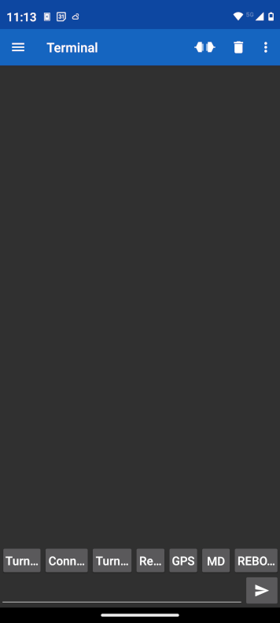
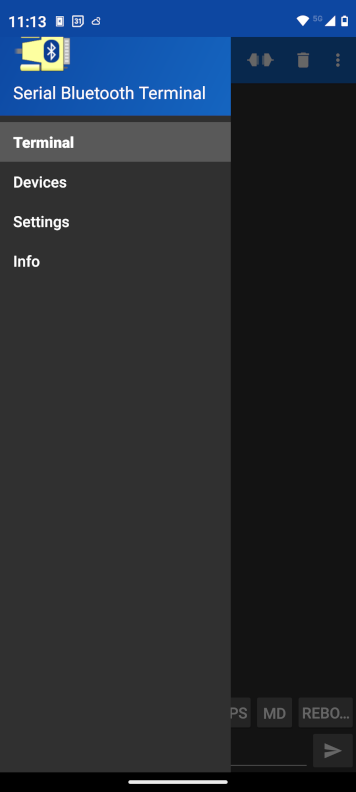
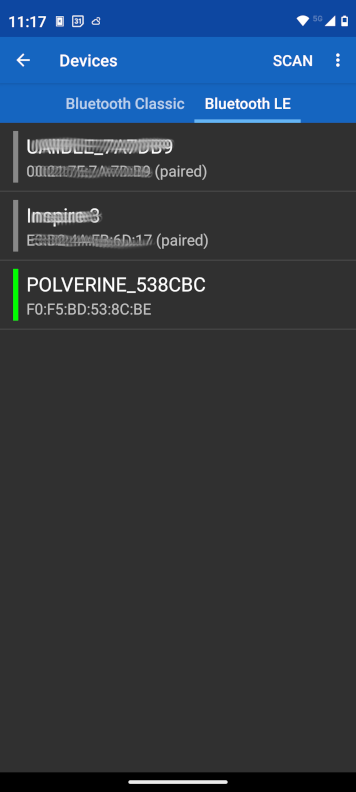
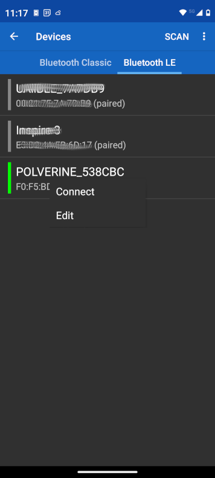
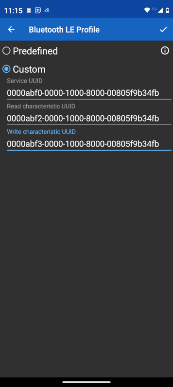
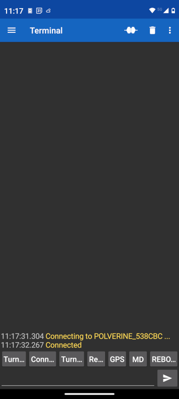
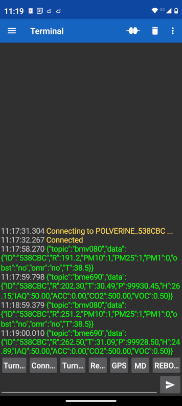

## POLVERINE_FULL_BLE_DEMO: BLE Sensors Data Collection

### An easy to use Solution

You can use [Serial Bluetooth Terminal](https://play.google.com/store/apps/details?id=de.kai_morich.serial_bluetooth_terminal) app in Android and iOS with a custom BLE serial profile to receive the data.

The data is transmitted using BLE serial emulation in two messages. Each message includes a topic field (indicating the sensor name) and a data field (containing the device’s unique SENSORID, which is the last six characters of its MAC address).

The messages are formatted in JSON, for example:

1) bmv080 message

```json
{
"topic":"bmv080",
"data":{
		"ID": "54ADD8",
		"R": 9131.2,
		"PM10": 32,
		"PM25": 24,
		"PM1": 11,
		"obst": "no",
		"omr": "no",
		"T": 11.1
	}
}
```

2) bme690 message

```json
{
"topic":"bme690",
"data":{	
	  "ID": "54ADD8",
	  "R": 8556.6,
	  "T": 6.25,
	  "P": 98956.57,
	  "H": 98.75,
	  "IAQ": 73.9,
	  "ACC": 3,
	  "CO2": 1026.85,
	  "VOC": 1.76
	}
}
```

To see the data in Android app start the "Serial Bluetooth Terminal" app:



then select the app menù:

 

and devices menù to visualize the list of BLE devices:

 

lay the finger on the POLVERINE_XXXXXX to show the context menù:

 

select the Edit menù to edit the connection profile.

 

Confirm the Custom profile and select the connect menù.

 

Wait 1 minute to let data arrive tp the terminal:

 

