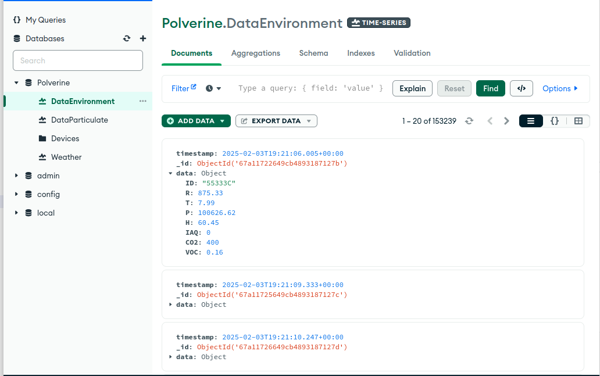
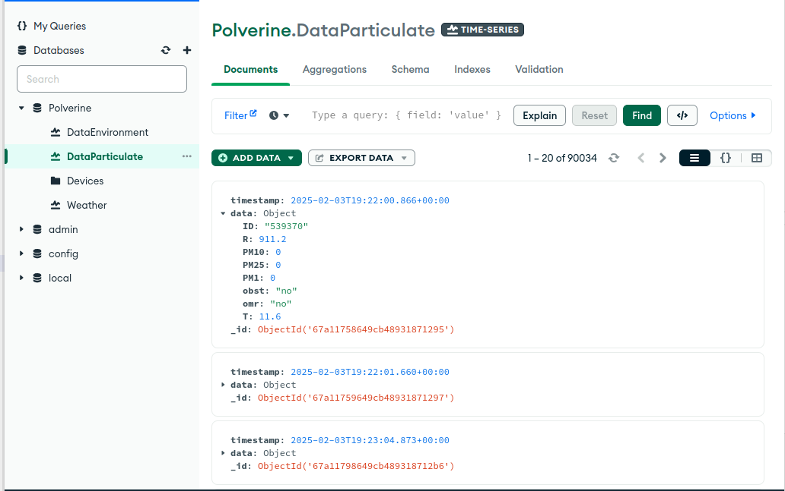
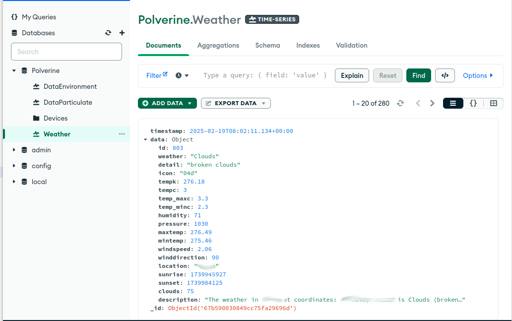
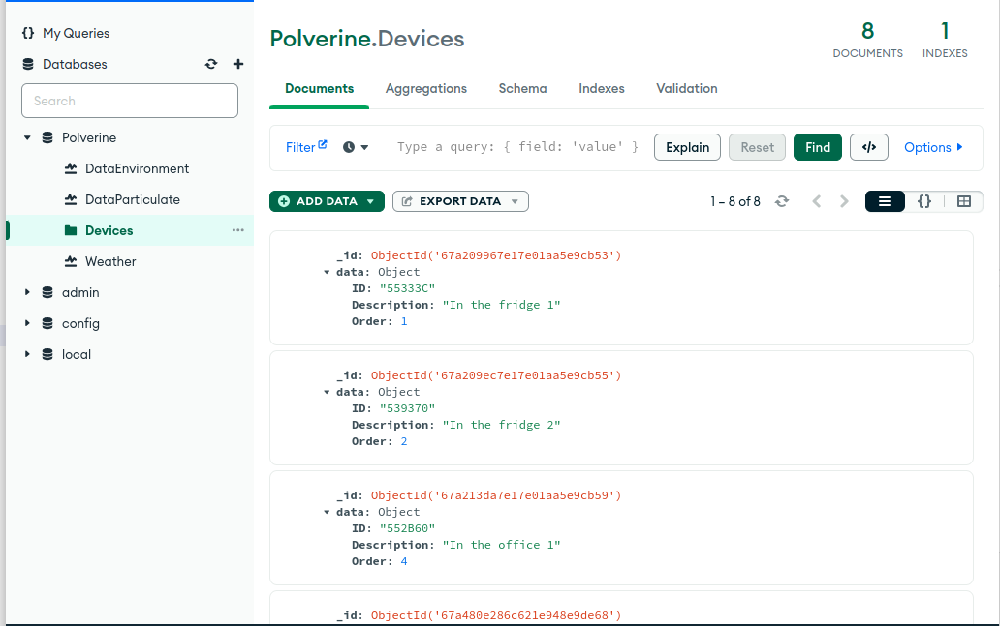

## MongoDB Database

- Install MongoDB
- Install MongoDB Compass application
- Create a Database named Polverine
- Create a Time-Series Collection named DataEnvironment and with timeFiled named timestamp. This Collection will receive BME690 sensor data
- Create a Time-Series Collection named DataParticulate and with timeFiled named timestamp. This Collection will receive BMV080 sensor data
- Create a Time-Series Collection named Weather and with timeFiled named timestamp. This Collection will receive OpenWeatherMap data
- Create a standard Collection named Devices. This collection must be populated and maintained manually to list all Polverine devices in the network.

